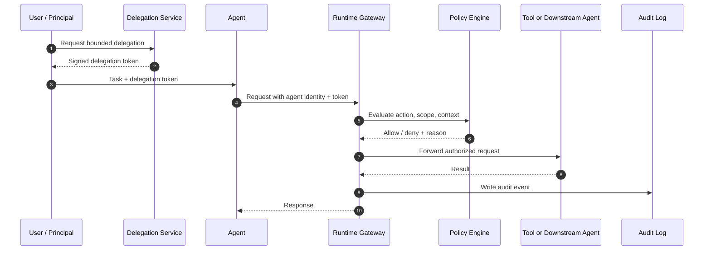

# Delegated Trust Layer Specification (v0.1 Draft)

## Overview

This document defines a draft technical specification for a pluggable trust layer for AI agents. The design is intended to work with agent interoperability protocols such as A2A and MCP while relying on established identity and authorization patterns such as workload identity, OAuth-style delegation, and runtime policy enforcement.[1][2][3]

The specification focuses on five technical pillars: identity, delegation, discovery, enforcement, and auditability.[4][5][6]

## Design principles

- Delegation over impersonation: an agent keeps its own identity while acting on behalf of another principal.[7][8]
- Protocol agnosticism: the trust layer should wrap MCP, A2A, HTTP, gRPC, and other transports without redefining them.[2][9]
- Pluggability: identity providers, policy engines, and audit sinks should be replaceable.[3][10]
- Progressive adoption: existing OAuth, OIDC, IAM, API key, and workload identity systems should be mappable into the trust model.[11][12][13]
- Continuous verification: identity, delegation, and policy should be checked at each hop instead of only once at session start.[5][14]

## Core entities

| Entity | Definition |
|---|---|
| Principal | A human user, service, organization, or system that owns authority. [15] |
| Agent | A software actor with its own identity that can perform actions directly or on behalf of a principal. [7][8] |
| Delegation | A bounded grant of authority from a principal to an agent. [4][16] |
| Tool | A callable service, API, or resource that an agent wants to access. [2][17] |
| Trust Domain | An administrative boundary in which identities, policies, and issuers are recognized. [10][18] |
| Policy Decision Point | The component that evaluates whether a requested action is allowed. [19][20] |
| Enforcement Point | The component that blocks or permits requests inline. [5][21] |

## Architectural components

| Component | Responsibility |
|---|---|
| Agent Naming Service | Assigns stable agent names and binds them to identity records. [6] |
| Agent Registry | Stores signed identity metadata, capabilities, supported protocols, and endpoint hints. [6][22] |
| Identity Provider Bridge | Resolves and validates agent identity through SPIFFE, OIDC, cloud workload identity, or custom PKI. [23][10][18] |
| Delegation Service | Issues, signs, validates, and revokes delegation tokens. [15][4] |
| Resolution Service | Maps trusted agent names to endpoints, gateways, or service descriptors. [6] |
| Protocol Adapter Layer | Normalizes MCP, A2A, HTTP, and gRPC requests into a standard authorization envelope. [2][9] |
| Policy Engine | Evaluates action, scope, resource, time, risk, and intent. [19][24] |
| Runtime Gateway | Enforces identity and policy at request time. [5][21] |
| Audit Log | Persists request chain, decisions, approvals, and outcomes. [25][16] |
| Control Plane | Exposes management APIs for policy, approvals, simulation, and reporting. [26][27] |

## Logical flow



GitHub-flavored Markdown supports Mermaid code blocks, which makes this format suitable for technical docs stored in repositories.[28][29]

## Identity document schema

The identity document should describe who the agent is, how it proves identity, and how other systems can discover and trust it.[30][6]

### JSON schema goals

The schema should be versioned, explicit, and easy to validate in tooling. OpenAPI 3.1 aligns with modern JSON Schema support and is a practical base for future API and schema publication.[31][32]

### Example identity document

```json
{
  "spec_version": "0.1",
  "kind": "AgentIdentityDocument",
  "agent_id": "agent:example:scheduler:v1",
  "display_name": "example Scheduler Agent",
  "owner_id": "org:example",
  "issuer": "https://trust.example.ai",
  "identity_type": "spiffe",
  "subject": "spiffe://example.ai/agents/scheduler",
  "public_keys": [
    {
      "kid": "key-2026-01",
      "kty": "OKP",
      "crv": "Ed25519",
      "x": "base64url-public-key"
    }
  ],
  "supported_protocols": ["a2a", "mcp", "https"],
  "supported_auth_methods": ["delegation_token", "oidc", "mtls"],
  "capabilities": [
    "schedule_meeting",
    "send_follow_up_email",
    "read_calendar_availability"
  ],
  "endpoints": [
    {
      "protocol": "a2a",
      "url": "https://agents.example.ai/scheduler/a2a"
    },
    {
      "protocol": "mcp",
      "url": "https://agents.example.ai/scheduler/mcp"
    }
  ],
  "attestation": {
    "type": "workload",
    "issuer": "spire://example-prod",
    "evidence_ref": "urn:attest:spire:cluster-a"
  },
  "created_at": "2026-06-01T20:00:00Z",
  "expires_at": "2026-06-08T20:00:00Z",
  "signature": "base64url-signature"
}
```

### Required fields

| Field | Purpose |
|---|---|
| `spec_version` | Enables versioned parsing and migration. [31][32] |
| `kind` | Distinguishes the object type. |
| `agent_id` | Stable canonical identifier. [6] |
| `owner_id` | Binds the agent to an owning tenant or principal. [15] |
| `issuer` | Identifies the authority publishing the identity document. [33] |
| `identity_type` | Indicates the proof system, such as SPIFFE or OIDC. [10][3] |
| `subject` | Carries the provider-specific subject or workload identifier. [10][18] |
| `public_keys` | Supports signature verification and rotation. [33] |
| `supported_protocols` | Supports protocol negotiation. [2][1] |
| `supported_auth_methods` | Declares accepted trust mechanisms. |
| `endpoints` | Supports routing and resolution. [6] |
| `signature` | Protects document integrity. |

## Delegation token schema

The delegation token is the artifact that binds an agent to bounded authority from a delegator.[4][16]

### Example delegation token payload

```json
{
  "spec_version": "0.1",
  "kind": "DelegationToken",
  "token_id": "dlg_01J0EXAMPLE",
  "issuer": "https://trust.example.ai",
  "agent_id": "agent:example:scheduler:v1",
  "delegator_id": "user:jake-abendroth",
  "owner_id": "org:example",
  "audience": [
    "tool:google-calendar",
    "tool:gmail"
  ],
  "intent": "schedule_demo_and_send_confirmation",
  "allowed_actions": [
    "calendar.create_event",
    "calendar.read_availability",
    "gmail.send_message"
  ],
  "resource_constraints": {
    "calendar_ids": ["primary"],
    "email_domain_allowlist": ["example.com"]
  },
  "max_spend": {
    "amount": 0,
    "currency": "USD"
  },
  "max_delegation_depth": 0,
  "approval_policy": {
    "mode": "required_for_external_email"
  },
  "issued_at": "2026-06-01T20:10:00Z",
  "expires_at": "2026-06-01T20:40:00Z",
  "nonce": "random-nonce",
  "signature": "base64url-signature"
}
```

### Required semantics

- Tokens should be short-lived and revocable.[34][15]
- The token should bind both the agent and the delegator, not just one of them.[4][7]
- The token should specify explicit allowed actions rather than broad trust statements.[24][4]
- The token should support intent-bound delegation so permissions remain tied to purpose.[16]
- Downstream redelegation should be disabled by default and enabled only with explicit depth controls.[4]

## Request verification algorithm

A receiving trust gateway should evaluate requests in the following order:

1. Normalize the incoming request through a protocol adapter.[2][9]
2. Resolve the presented agent identity from the identity document or registry.[6][30]
3. Verify the identity signature, key validity, and expiration.[33][18]
4. Validate the delegation token signature, issuer, audience, and lifetime.[4][35]
5. Confirm the token binds to the presented `agent_id`.[7][8]
6. Evaluate requested action against `allowed_actions`, resource constraints, local policy, and runtime context.[19][24]
7. If required, invoke approval workflow or additional trust checks.[26][27]
8. Execute the request only after policy returns allow.[5]
9. Write a detailed audit event regardless of allow or deny outcome.[25][16]

## Discovery and metadata

The system should support a discovery model similar in spirit to OpenID Connect metadata publication, where a server publishes machine-readable configuration at a well-known location.[33][36]

A trust domain or registry should publish metadata that includes:

- issuer identifier,
- supported token formats,
- public key set URL,
- registry URL,
- resolution URL,
- supported protocols,
- supported policy hints,
- approval and revocation endpoints.[33]

This enables automated client configuration and lowers integration complexity.[33][12]

## Compatibility requirements

To support broad adoption, the specification should define compatibility profiles:

- **OIDC profile** for environments with conventional enterprise identity providers.[12][36]
- **SPIFFE profile** for workload-centric infrastructure and service identity.[10][18]
- **Developer profile** for local or low-assurance environments using simpler bootstrap mechanisms during migration.[13][37]
- **Hybrid bridge profile** for organizations mapping existing service accounts, IAM roles, or API keys into delegation flows.[13][3]

## Operational requirements

The specification should support the following operational features:

- revocation endpoint,
- emergency deny list,
- approval callbacks,
- policy simulation mode,
- audit export,
- interoperability tests,
- version negotiation.[26][27][38]

## Open issues

- How attestation should be standardized across providers remains unsettled.[30]
- How cross-registry federation should work is still an open design question.[22][6]
- The minimum common policy language is not yet fixed.[19][20]
- The trust score model should remain optional until its semantics are less ambiguous.[34][39]
