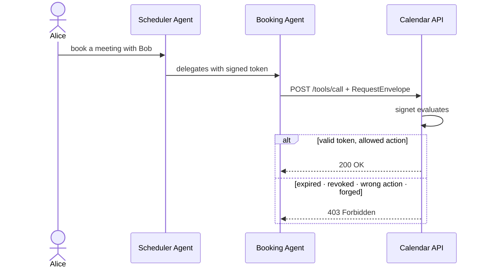

# signet

AI agents call APIs, send emails, book meetings, and delegate work to other agents. Most do this with no credential that proves they were authorized to.

`signet` is the trust layer for agent actions. Every request carries a cryptographically signed delegation token proving who authorized it, what it can do, and when that authority expires. Requests without a valid token are rejected before your handler runs.

[](https://crates.io/crates/signet)
[](https://docs.rs/crate/signet/latest)
[](https://github.com/abendrothj/delegated/actions/workflows/ci.yml)

---

## How it works

An agent that wants to act on a user's behalf presents a `RequestEnvelope` — a signed bundle containing its identity document and a delegation token. `signet` evaluates that envelope before your code runs.



Every arrow in the chain is verified. An agent cannot claim permissions it was not granted, reuse a token after it expires, or forge a token it did not sign.

## What signet guarantees

- **Verified identity** — the agent's identity document is Ed25519-signed; forgeries fail immediately
- **Authorized actions** — the token names exactly which actions are permitted; anything outside that scope is blocked
- **Time-bounded authority** — tokens expire; replayed tokens are detected and rejected
- **Revocation** — tokens and agents can be revoked instantly; the store fails closed if it is unavailable
- **Auditable decisions** — every allow and deny is written to a structured JSONL audit log
- **Delegation depth** — the chain length is tracked by your infrastructure, never by the agent itself

## The wire format

An agent request is a JSON object. Here is the shape of a `RequestEnvelope` (fields trimmed for clarity):

```json
{
  "spec_version": "0.1",
  "kind": "TrustRequestEnvelope",
  "agent_id": "agent:example:scheduler:v1",
  "delegator_id": "user:alice",
  "audience": "tool:google-calendar",
  "action": "calendar.create_event",
  "delegation_token": {
    "token_id": "dlg_01J0EXAMPLE",
    "allowed_actions": ["calendar.create_event"],
    "expires_at": "2026-06-01T21:00:00Z",
    "nonce": "...",
    "key_id": "key-2026-01",
    "signature_alg": "Ed25519",
    "signature": "..."
  },
  "identity_document": {
    "agent_id": "agent:example:scheduler:v1",
    "public_keys": [{ "kid": "key-2026-01", "kty": "OKP", "crv": "Ed25519", "x": "..." }],
    "expires_at": "2026-06-08T20:00:00Z",
    "signature": "..."
  }
}
```

The full schema is defined in [`SPEC.md`](SPEC.md). Signatures use canonical JSON with deterministic key ordering, making the format straightforward to implement in any language.

---

## Quickstart — protecting a server

Drop `signet` in as Tower middleware. Every POST to your route is evaluated before your handler runs.

```rust
use std::sync::Arc;
use signet::{TrustLayerBuilder, InMemoryAsyncTrustState, JsonlFileAuditSink};

let trust_state = Arc::new(InMemoryAsyncTrustState::new());
let sink = Arc::new(JsonlFileAuditSink::new("audit.jsonl"));

let app = axum::Router::new()
    .route("/tools/call", axum::routing::post(my_handler))
    .layer(
        TrustLayerBuilder::new(trust_state, sink).build()
    );
```

Denied requests return `403` with `{"allowed": false, "stage": "...", "reason": "..."}`. Oversized bodies return `413`. Your handler only runs when everything checks out.

## Quickstart — issuing a token

Build a `RequestEnvelope` with the issuance builders and attach it to outbound requests.

```rust
use signet::{
    TrustClient,
    issuance::{AgentIdentityDocumentBuilder, DelegationTokenBuilder, RequestEnvelopeBuilder},
};
use ed25519_dalek::SigningKey;

let key = SigningKey::from_bytes(&secret_key_bytes);

let doc = AgentIdentityDocumentBuilder::new()
    .agent_id("agent:example:scheduler:v1")
    .owner_id("org:example")
    .issuer("https://trust.example.ai")
    .identity_type("spiffe")
    .subject("spiffe://example.ai/agents/scheduler")
    .key_id("key-2026-01")
    // Register an additional key for rotation:
    .additional_public_key("key-2026-02", &rotation_key.verifying_key())
    .supported_protocol("http")
    .supported_auth_method("delegation_token")
    .endpoint("http", "https://agents.example.ai/scheduler")
    .build_and_sign(&key)?;

let token = DelegationTokenBuilder::new()
    .issuer("https://trust.example.ai")
    .agent_id("agent:example:scheduler:v1")
    .delegator_id("user:alice")
    .owner_id("org:example")
    .audience("tool:google-calendar")
    .allowed_action("calendar.create_event")
    .key_id("key-2026-01")
    .expires_in(chrono::Duration::hours(1))
    .build_and_sign(&key)?;

let envelope = RequestEnvelopeBuilder::new()
    .identity_document(doc)
    .token(token)
    .audience("tool:google-calendar")
    .action("calendar.create_event")
    .build()?;

let client = TrustClient::new();
let resp = client.evaluate_http("https://api.example.com/trust", &envelope).await?;
if resp.is_allowed() {
    // proceed
}
```

## Standalone adapters

Call the protocol adapters directly when you are not using axum:

```rust
use signet::{handle_http_json_request, handle_mcp_jsonrpc_request, handle_a2a_request};
use signet::JsonlFileAuditSink;
use chrono::Utc;

let sink = JsonlFileAuditSink::new("audit.jsonl");

// HTTP
let response = handle_http_json_request(&raw_body, Utc::now(), &sink);

// MCP JSON-RPC
let response = handle_mcp_jsonrpc_request(&raw_body, Utc::now(), &sink);

// A2A
let response = handle_a2a_request(&raw_body, Utc::now(), &sink);
```

---

## Trust pipeline

Every evaluation runs these stages in order. The first failure stops the chain and returns a denial.

1. `normalize_request` — parse and contract-validate the envelope
2. `validate_profile_compatibility` — SPIFFE / OIDC / Developer profile checks
3. `verify_signatures` — Ed25519 on identity document and delegation token
4. `validate_identity_document_lifetime` — expiry with configurable clock leeway
5. `enforce_revocation_and_redelegation` — revocation, emergency deny, nonce replay, delegation depth
6. `validate_token_lifetime` — token `issued_at` / `expires_at` window
7. `validate_token_binding` — `agent_id`, `delegator_id`, audience cross-check
8. `evaluate_policy` — allowed actions, spend limits, calendar and email constraints, cognitive and reputation gates

## Host context vs request runtime context

Security-sensitive trust signals — delegation depth, cognitive scores, reputation, extra approvals, clock leeway — are supplied by your infrastructure via `HostContext` and are **never read from the inbound request**. An agent cannot self-elevate by putting `"delegation_depth": 0` in its JSON.

`runtime_context` (requested spend amount, target email address, target calendar ID) is caller-provided and used only for non-security policy checks.

## Trust state

**Sync** (CLI / single-process):

```rust
use signet::{InMemoryTrustState, FileBackedTrustState, TrustStateAdmin};
use std::sync::Arc;

let state = Arc::new(InMemoryTrustState::new());
state.revoke_token("dlg_abc")?;
state.emergency_deny_agent("agent:bad")?;
state.revoke_tokens(&["dlg_1", "dlg_2", "dlg_3"])?;
state.flush_expired_nonces(chrono::Utc::now())?;

// File-backed (advisory lock, single-process only)
let state = FileBackedTrustState::new(signet::default_trust_state_path());
```

**Async** (production — Redis):

```rust
#[cfg(feature = "redis")]
use signet::RedisTrustStateStore;
let state = Arc::new(RedisTrustStateStore::connect("redis://127.0.0.1").await?);
```

Set `SIGNET_REQUIRE_SHARED_BACKEND=1` (or `SIGNET_ENV=production`) to enforce that production deployments use a shared backend. With this set, the sync convenience paths fail closed and `TrustLayerBuilder::build()` panics on a non-shared store. Use `TrustLayerBuilder::try_build()` for graceful error handling in async initializers.

## Revocation and control plane

```rust
use signet::{
    revoke_token_with_receipt, emergency_deny_agent,
    HostContext, InMemoryTrustState,
};

let state = InMemoryTrustState::new();

// Revoke with an auditable receipt
let op = revoke_token_with_receipt(
    &state, "req_123", "dlg_abc".to_string(), "user:operator",
    Some("compromised".to_string()), chrono::Utc::now(),
)?;
println!("receipt: {}", op.receipt.request_id);
```

`simulate_policy` runs policy checks only — no signature, lifetime, revocation, or binding verification. Use it for configuration testing and policy preview. **Never use it as a production security gate.**

## Custom policy

```rust
use signet::{Policy, PolicyCheck, RequestEnvelope, HostContext};

struct MyPolicy;
impl Policy for MyPolicy {
    fn evaluate(&self, envelope: &RequestEnvelope, ctx: &HostContext) -> Vec<PolicyCheck> {
        vec![PolicyCheck {
            name: "namespace_check".to_string(),
            passed: envelope.agent_id.starts_with("agent:trusted:"),
            reason: "agent not in trusted namespace".to_string(),
        }]
    }
}

// Pass to evaluate_request_with_policy / evaluate_and_audit_with_policy
```

Note: `resource_constraints.extra` in a token is **not evaluated by `DefaultPolicy`**. To enforce custom extra constraints, call `check_extra_constraints` inside your own `Policy` implementation — see its documentation for an example.

---

## Cross-language and interoperability

The wire format is defined in [`SPEC.md`](SPEC.md): JSON objects with canonical key ordering (keys sorted lexicographically before signing), Ed25519 signatures encoded as base64url-no-pad, and a fixed eight-stage evaluation pipeline. Any language can implement a compatible token issuer or evaluator against that spec.

Protocol adapters included: [HTTP](src/adapters/http.rs) · [MCP JSON-RPC](src/adapters/mcp.rs) · [A2A](src/adapters/a2a.rs) · [axum Tower middleware](src/adapters/axum_layer.rs)

If you are implementing `signet` in another language, open an issue — reference test vectors are on the roadmap and we want to know what you need.

## CLI

```bash
# Sign an identity document
signet sign-identity identity.json <base64url-private-key>

# Sign a delegation token
signet sign-token token.json <base64url-private-key>

# Verify a request envelope offline
signet verify-request request.json

# Interactive grant approval
signet approve-grant-interactive proposal.json user:operator

# Revoke a token (persists to ~/.signet/trust-state.json)
signet revoke-token req_123 dlg_abc user:operator --reason "manual revoke"
```

---

## Feature flags

| Flag | What it enables |
|---|---|
| *(none)* | Core evaluation pipeline, adapters, builders, file-backed state |
| `async` | `AsyncTrustStateStore` trait + async engine variants |
| `axum` | `TrustLayer` Tower middleware for axum |
| `client` | `TrustClient` for sending trust-validated outbound requests |
| `redis` | `RedisTrustStateStore` backed by Redis (async) |
| `tracing` | `tracing` spans on the evaluation hot path |
| `metrics` | `metrics` counters (`signet_requests_total`) and histograms |
| `oidc-bridge` | `IdentityVerifier` trait for OIDC-based identity verification |

## Security and reliability

- Security policy and reporting: [`SECURITY.md`](SECURITY.md)
- Threat model: [`docs/THREAT_MODEL.md`](docs/THREAT_MODEL.md)
- Production security checklist: [`docs/SECURITY_CHECKLIST.md`](docs/SECURITY_CHECKLIST.md)
- Known limits: [`docs/KNOWN_LIMITS.md`](docs/KNOWN_LIMITS.md)
- CI enforces format / lint / tests / publish dry-run on every push and PR

Quick local baseline benchmark:

```bash
cargo run --release --example eval_benchmark -- 20000
```

## Production

- Spec: [`SPEC.md`](SPEC.md)
- Operations runbook: [`docs/OPERATIONS.md`](docs/OPERATIONS.md)
- 30-minute integration path: [`docs/INTEGRATION_GUIDE.md`](docs/INTEGRATION_GUIDE.md)
- Conformance runner: `./scripts/conformance.sh`
- External interop runner: `./scripts/external_interop.sh` (requires `SIGNET_INTEROP_HTTP_URL`)
- Release gate: `./scripts/release_check.sh`

## Repository layout

```
src/
  engine.rs            — trust evaluation orchestration
  stages.rs            — individual evaluation stages
  policy.rs            — built-in policy checks
  revocation.rs        — TrustStateStore/Admin traits + InMemoryTrustState + FileBackedTrustState
  revocation_async.rs  — AsyncTrustStateStore/Admin + InMemoryAsyncTrustState
  revocation_redis.rs  — RedisTrustStateStore (feature: redis)
  issuance.rs          — DelegationTokenBuilder + AgentIdentityDocumentBuilder + RequestEnvelopeBuilder
  adapters/
    http.rs            — HTTP adapter
    mcp.rs             — MCP JSON-RPC adapter
    a2a.rs             — A2A adapter
    axum_layer.rs      — Tower Layer middleware (feature: axum)
    guard.rs           — rate limit + concurrency guard
  client.rs            — TrustClient (feature: client)
  audit.rs             — AuditSink trait + JsonlFileAuditSink
  discovery.rs         — DiscoveryService + JWKS handlers
  control_plane.rs     — revocation receipts + operational reports
  crypto.rs            — signing + verification primitives
tests/
  conformance.rs       — end-to-end allow/deny/replay/revocation
  interop_harness.rs   — cross-adapter and cross-profile parity
  reference_cli.rs     — CLI signing/verification/approval workflows
  integration_server.rs — real axum server + TrustClient round-trips
```

## Testing

```bash
# Core tests
cargo test

# Integration tests (requires axum + client features)
cargo test --features "axum,client" --test integration_server

# With all optional features
cargo test --features "async,axum,client,tracing,metrics"
```

## License

Licensed under either [MIT](LICENSE-MIT) or [Apache-2.0](LICENSE-APACHE) at your option.
